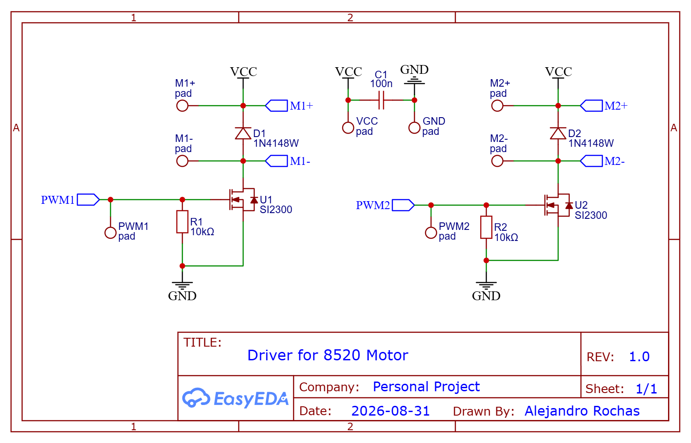

# HARDWARE DESCRIPTION

This document describes the hardware used in the project, including the main design decisions, component selection, prototypes, and costs.

## Design Constraints

The hardware design is driven by a set of deliberate constraints:

- LEGO Technic must be used as the mechanical frame.
- The Raspberry Pi Pico is the main flight controller.
- FreeRTOS is used for the firmware.
- Custom electronics are preferred over commercially available drone-specific boards.

## Frame

The LEGO Technic frame is one of the defining constraints of the project. I had multiple boxes of LEGO Technic from my childhood, so I decided to use them as the basis for the drone frame rather than using a conventional drone frame.

Multiple frame iterations were built and tested before reaching the current design. Most of the early prototypes were too large, as I initially tried to build the main structure from individual LEGO elements. Some of the discarded concepts are shown below.

The different prototypes were evaluated mainly based on rigidity, size, weight, motor placement, and ease of component integration.

The final design is based on a rigid LEGO Technic base originally intended for a truck trailer base. It provides a good compromise between rigidity, compactness, and component integration.

The selected frame dimensions also constrain the propulsion system to small brushed DC motors. 8520 motors were selected because they provide a suitable compromise between size, weight, cost, and available thrust for the current frame.

Brushed motors also simplify the electrical design because they can be driven directly using MOSFET-based motor drivers, without requiring an ESC for each motor.

## Electronics

The Raspberry Pi Pico is used as the main controller. The first unit was already available when the project started, and an additional unit was later purchased for the final PCB. The first IMU module was also available when the project started. It was later damaged during development and replaced with a different module, which also included a barometer.

The motor drivers are custom-designed using MOSFETs, diodes, and resistors. A capacitor is used to reduce the effect of current transients generated by the motors.

The battery was selected primarily based on the motors, the available space within the frame and the requirements of the propulsion system. Motor thrust and the estimated total vehicle weight were also considered during the propulsion-system selection.

Radio control is based on ExpressLRS (ELRS), chosen as a low-cost and widely supported RC system. Even though the transmitter is one of the most expensive individual components of the project, the system provides a suitable interface for the final prototype.

### Estimated Price

I have indicated the price of the ones I bought. Most of them were bought in Aliexpress, so prices may vary. In the case of packs, I have included the price of the whole pack as you can usually buy a standalone resistor (and prices are low anyway)

| Component | Weight (g) | Price (€) |
|---|---|---|
| Motor 8520 Brushed x4 | 20 | 4.38 |
| Propellers (price included in motor) x4 | 0 | 0.00 |
| Raspberry Pi Pico | 5 | 3.49 |
| IMU (10-axis: L3GD20, LSM303D) | 1 | 7.39 |
| 10k Resistor SMD x4 (x470 pack) | 0 | 1.05 |
| MOSFET SI2300 SMD x4 (x100 pack) | 0.2 | 2.18 |
| Diode 1N4148W SMD x4 (x100 pack) | 0 | 1.26 |
| Motor driver PCB ×2 | TBD | TBD |
| ExpressLRS Transmitter Module | 0 | TBD |
| ExpressLRS Receiver Module | 0 | TBD |
| Battery 1S 30C 400 mAh (x5 + charger) | 11 | 18.99 |
| Battery Connector Molex 51005 | 0 | 1.99 |
| Capacitor 470µF | 0 | 0.00 |
| Capacitor 100nF x4 (x100 pack) | 0 | 1.60 |
| Wiring (miscellaneous) | 1 | 0.00 |
| Frame (LEGO Technic) | 20 | 0.00 |
| Main Controller PCB | TBD | TBD |
| **Total** | | **41.33 €** |

## PCBs

The final electronics are distributed across three PCBs:
- Two identical motor-driver boards, mounted on each pair of arms.
- One main PCB with LEGO Technic-compatible mounting holes, allowing the PCB to become part of the mechanical structure.

The PCB designs are currently under development. The motor-driver PCB can be fabricated independently, while the main PCB will be finalized after the RC receiver and remaining hardware have been selected.

### PCB Driver Motor

### PCB Raspberry Pi Pico

