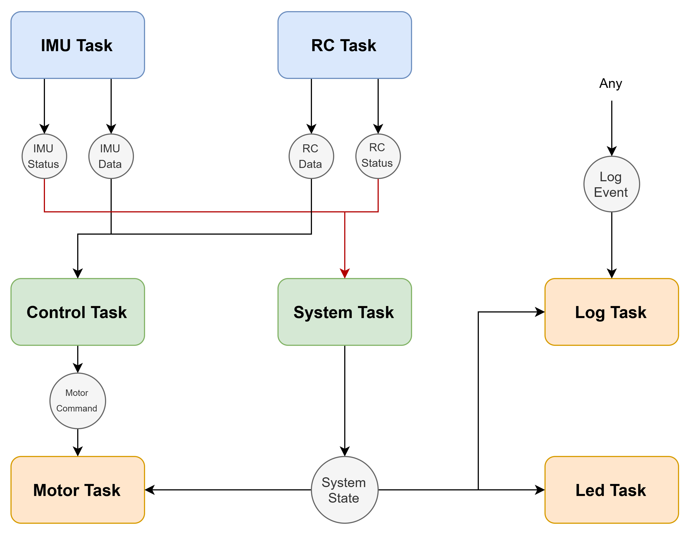

# Task Communication Matrix

## Communication overview

| Message | Producer | Consumer | Type | Frequency / Trigger | Data | Purpose |
|---|---|---|---|---|---|---|
| `ImuData` | IMU Task | Control Task | Periodic | TBD | IMU measurements | Provide sensor data to the control loop |
| `ImuStatus` | IMU Task | System Task | Periodic | TBD | IMU health/status | Report IMU availability and faults |
| `RcData` | RC Task | Control Task | Periodic | TBD | RC inputs | Provide pilot commands |
| `RcStatus` | RC Task | System Task | Periodic | TBD | RC health/status | Report RC availability and faults |
| `SystemState` | System Task | Motor Task, LED Task, Log Task | Periodic | TBD | Current system state | Distribute system-level state |
| `MotorCommand` | Control Task | Motor Task | Periodic | TBD | Motor outputs | Command the motors |
| `LogEvent` | Any task / component | Log Task | Event | TBD | Diagnostic event data | Record system events and faults |

### Task Diagram

## Control-loop timing

The control loop is driven by IMU updates (TBD).

**IMU update rate:**  
**Control-loop rate:**  
**RC update rate:**  
