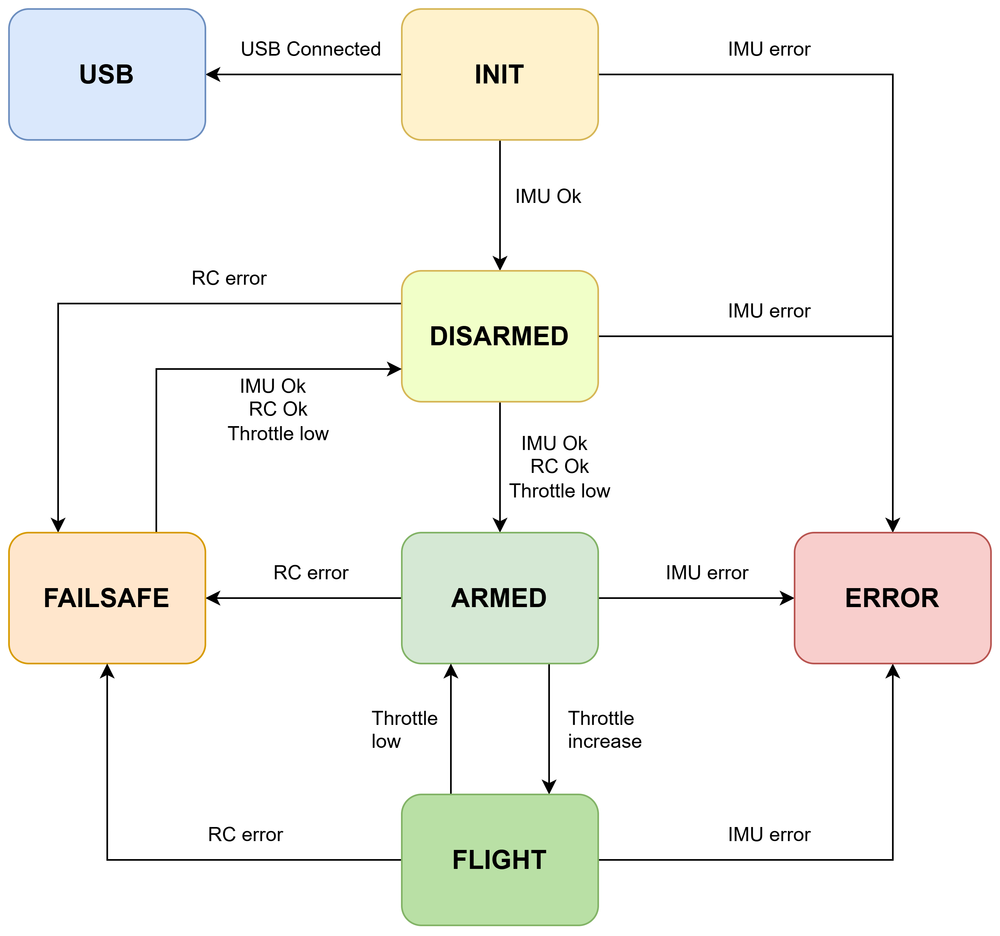

# System State Machine

## General rules

- State transitions are evaluated once per system update cycle.
- Timed conditions require consecutive cycles.
- A timed-condition counter is reset when its condition becomes false.
- Safety transitions have priority over functional transitions.

## States

### INIT

- USB connected -> USB
- IMU healthy for INIT_COUNTDOWN consecutive cycles -> DISARMED
- IMU unhealthy for IMU_COUNTDOWN consecutive cycles -> ERROR
- Otherwise -> INIT

Priority:

1. USB
2. ERROR
3. DISARMED

### USB

- Special mode for testing with USB power instead of batteries. Motors are unable to move in this state.
- No automatic transitions.
- Remains in USB until manual reset.

### DISARMED

- IMU unhealthy for IMU_COUNTDOWN consecutive cycles -> ERROR
- RC unhealthy for RC_COUNTDOWN consecutive cycles -> FAILSAFE
- Throttle below ARM threshold -> ARMED
- Otherwise -> DISARMED

Priority:

1. ERROR
2. FAILSAFE
3. ARMED

### ARMED

- IMU unhealthy for IMU_COUNTDOWN consecutive cycles -> ERROR
- RC unhealthy for RC_COUNTDOWN consecutive cycles -> FAILSAFE
- Throttle above FLIGHT threshold -> FLIGHT
- Otherwise -> ARMED

Priority:

1. ERROR
2. FAILSAFE
3. FLIGHT

### FLIGHT

- IMU unhealthy for IMU_COUNTDOWN consecutive cycles -> ERROR
- RC unhealthy for RC_COUNTDOWN consecutive cycles -> FAILSAFE
- Throttle below ARM threshold for THROTTLE_LOW_COUNTDOWN consecutive cycles -> ARMED
- Otherwise -> FLIGHT

Priority:

1. ERROR
2. FAILSAFE
3. ARMED

### FAILSAFE

- RC healthy AND IMU healthy -> DISARMED
- Otherwise -> FAILSAFE

### ERROR

- No automatic transitions.
- Remains in ERROR until manual reset.